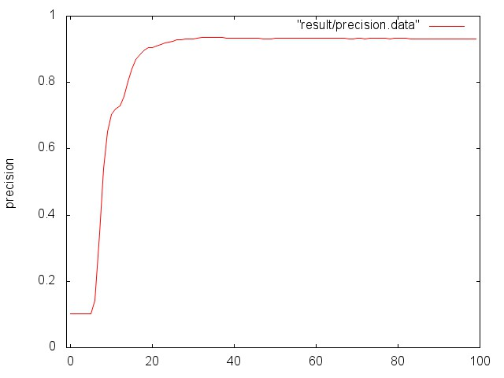
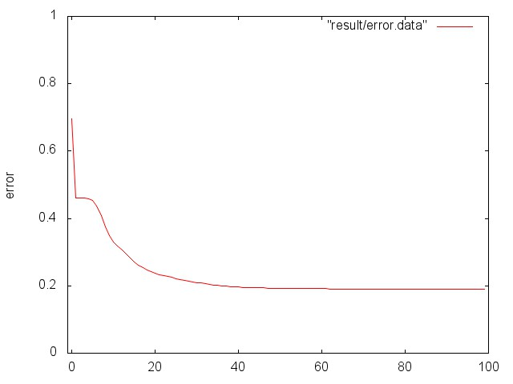

#BP neural network
使用BP神经网络进行手写数字的识别

##开发平台
OS X Yosemite 10.10.1

##运行程序
首先将训练数据集`digitstra.txt`和测试数据集`digitstest.txt`拷贝到 data 文件夹下。

然后在终端进入文件目录`BP_neural_network`，输入：

$bash run.sh	-- 编译和运行程序，并进行测试

##输入输出说明
data/digitstra.txt		--训练数据集，一共3823条记录

data/digitstest.txt		--测试数据集，一共1517条记录

##数据集描述
数据集是过预处理程序从手写体数字提取的位图数据，每条记录里前64个数字是特征，最后一个数字代表手写数字的值
All input attributes are integers in the range 0..16. 

The last attribute is the class code 0..9

##训练结果
神经网络使用平方误差来判断结束，当平方误差小于0.1或者训练次数达到1000次时训练结束。然后使用这个网络对测试数据集进行准确度测试。测试结果会输出到stdout标准输出。

准确度变化情况：

平方误差变化情况：

##工具要求
G++ 4.6 或以上版本 --以支持c++11

gnuplot	--对结果画图